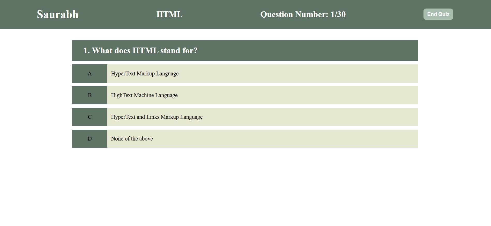

# Frontend Quiz Application

An interactive quiz application developed using **HTML**, **CSS**, and **JavaScript**. It challenges users with 30 multiple-choice questions and provides a login feature to track user access.

## Features

- **User Authentication**:  
  A login page to authenticate users before accessing the quiz.

- **Dynamic Quiz**:  
  - Contains 30 multiple-choice questions stored in JSON format within local storage.  
  - Questions are dynamically rendered on the quiz interface.

- **Interactive UI**:  
  Provides real-time feedback for a seamless user experience.

- **Responsive Design**:  
  Ensures compatibility with different devices and screen sizes.

## Technology Stack

- **HTML**
- **CSS**
- **JavaScript**
- **Local Storage (JSON)**

## How to Run the Project

1. Clone the repository:
   ```bash
   git clone https://github.com/ve-saurabh/FrontEnd-Quiz-Application.git
2. Navigate to the project Directory
   ```bash
   cd FrontEnd-Quiz-Application

## Screenshots
### Landing Page


### Registration Page


### Home Page


## Future Enhancement
- **Add timer functionality for the quiz.**
- **Enhance the UI with modern animations.**
- **Store User progress and score using a database.**
- **Deploy the project online for broader acess.**
